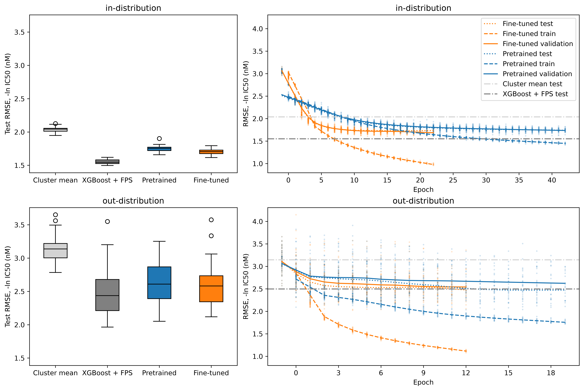
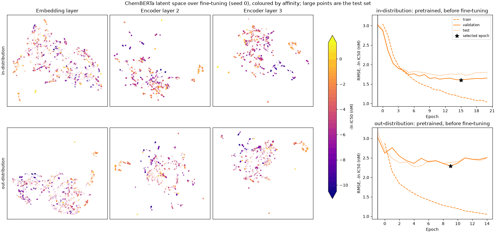
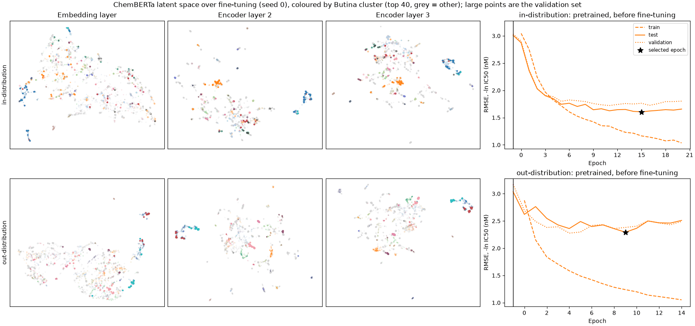

# bertsheep
Bidirectional encoder representations from transformers (BERT) for binding affinity (ba 🐑) prediction.
Fine-tunes the pre-trained language model ([ChemBERTa](https://arxiv.org/abs/2010.09885)) on [binding affinity](https://www.bindingdb.org/) of compounds to a single target (EGFR) and evaluates generalisation performance. 

Part of my work at Accenture Labs, refactored with Claude Code.

## Running
Run the tests: `uv run pytest`
Train the models: `uv run bertsheep EGFR`
Visualise the results: `uv run python -m bertsheep.results <path>`

## Setup
### Data
Download and unzip `BindingDB_All_202609_tsv` from BindingDB into `data/` -> `data/BindingDB_All_202609_tsv/BindingDB_All.tsv`

The target is wild-type human EGFR (UniProt `EGFR_HUMAN`, P00533). The dataset is generated by:

| Step | Rows left |
|---|---|
| Single-chain rows whose first chain is EGFR | 31,550 |
| Numeric IC50 > 0 (drops blanks and censored values such as `>10000`) and SMILES under 128 characters | 23,262 |
| Wild type only: the construct in Target Name has no point mutations, insertions or internal deletions (34 variants in total) | 16,789 |
| SMILES that RDKit can parse and that contain a ring (acyclic molecules have no scaffold to cluster on) | 16,781 |
| Repeated measurements of the same canonical SMILES collapsed to their median IC50 | 11,056 |

Labels are −ln IC50 (nM), i.e. natural log. The target frame is cached to `out/.cache/` after the first scan of the dump.

### Model
Model: [DeepChem/ChemBERTa-10M-MTR](https://huggingface.co/DeepChem/ChemBERTa-10M-MTR)

Pre-trained: frozen model + trained regression head
Fine-tuned: unfrozen model + trained regression head

### Splitting strategies

Compounds are split into Butina clusters (a relatively stringent clustering method).

### Cross-validation

!!! Not really cross-validation

Trained locally on an RTX 4060 with Optuna + TPESampler; hyperparameters are found on seed zero and shared across runs (due to computational limitations).

In-distribution: for Butina splits, we use stratified splitting by clusters to ensure equal representation of clusters.
Out-of-distribution: group shuffled splits ensure some clusters are held out.

### Training

Trained locally on an RTX 4060. Made possible by an approx. 2x speedup from bf16 autocast.

## Results

EGFR wild type, Butina clusters (minimum size 10), 30 seeds per arm and distribution. A seed resamples both the split and the model, and every arm sees the same split for a given seed, so arms are compared seed by seed.

### Optimal hyperparameters per arm

Tuned with Optuna (TPE) on seed 0's split, scored on validation, test never read. Trials: XGBoost 100, pre-trained 50, fine-tuned 50.

| Arm | Distribution | lr | weight decay | warmup | dropout |
|---|---|---|---|---|---|
| Pre-trained | in | 7.6e-3 | 0.018 | 0.042 | 0.097 |
| Pre-trained | out | 9.3e-3 | 0.131 | 0.074 | 0.138 |
| Fine-tuned | in | 2.4e-4 | 0.150 | 0.054 | 0.050 |
| Fine-tuned | out | 4.9e-4 | 0.224 | 0.026 | 0.065 |

| XGBoost | max depth | learning rate | subsample | colsample | min child weight | L2 |
|---|---|---|---|---|---|---|
| in | 10 | 0.015 | 0.96 | 0.25 | 1.1 | 1.23 |
| out | 10 | 0.070 | 0.92 | 0.85 | 6.6 | 0.005 |

### Model performance

Test RMSE in −ln IC50 (nM), mean ± SD over 30 seeds.

| Arm | In-distribution | Out-of-distribution |
|---|---|---|
| Cluster mean | 2.04 ± 0.04 | 3.15 ± 0.21 |
| XGBoost + FPS | 1.55 ± 0.04 | 2.50 ± 0.38 |
| Pre-trained | 1.75 ± 0.05 | 2.62 ± 0.31 |
| Fine-tuned | 1.71 ± 0.05 | 2.60 ± 0.33 |

**ChemBERTa learns more than cluster identity.** 
In-distribution performance of all models was higher than the cluster mean, suggesting the models are successfully learning features of the compounds that predict binding to EGFR. 

**XGBoost on fingerprints beats pre-trained and fine-tuned ChemBERTa.** 
In-distribution and out-of-distribution performance is higher for XGBoost trained on fingerprints versus ChemBERTa trained on SMILES. Other authors have observed [this](https://www.nature.com/articles/s41467-023-41948-6), and many reasons for weaker performance exist, including negative transfer and limited dataset size.

**Fine-tuning exhibits similar performance to the pre-trained model.**
Fine-tuning shows similar performance to the pre-trained model with a small advantage in-distribution (fine-tuned beats pre-trained in 25/30 seeds). 
This is potentially because the MTR pre-training method, which regresses ~200 RDKit descriptors, already learns affinity-relevant descriptors in the frozen latent space.

**Out-of-distribution, which clusters are held out matters more than which model is used.** The seeds are strongly correlated across arms. Seed 24 is the worst seed for XGBoost, pre-trained and fine-tuned (RMSE 3.55, 3.25, 3.58), where XGBoost and fine-tuning do worse than predicting the training mean (3.46), and seed 17 is the best for XGBoost and fine-tuned (1.96, 2.12). The spread across seeds (SD 0.31–0.38) is about three times the gap between the best and worst model (0.12). The test set also ranges from 708 to 2,250 molecules because clusters vary in size. A single held-out split would give a misleading ranking of these models.

The wide performance range out-of-distribution suggests that some clusters may be easier to predict than others; performance tracks across arms by seed (i.e. some seeds are easier to predict than others out-of-distribution).

### Latent space with fine-tuning

- **The embedding layer barely moves.** In both distributions its layout is nearly the same at the pre-trained weights and at the last epoch.
Fine-tuning changes the encoder layers, not the token embeddings.
- **The last encoder layer reorganises around affinity.** In-distribution, weak binders (dark) collect on one side of encoder layer 3 and potent ones (yellow/orange) on the other by the selected epoch. The same starts to happen out-of-distribution.
- **In-distribution, test molecules move with their training neighbours.** In the above figures, clusters are coloured if they are part of the test set. During in-distribution training, these clusters are associated with training compounds, so the test clusters are carried along into the affinity-sorted layout.
- **Out-of-distribution, the training molecules rearrange while the held-out molecules stay close to where they started.** 
During out-of-distribution training, the training molecules are still reorganised in the last layer to an affinity-sorted layout. In contrast, the test clusters remain relatively static, moving little and not following the training molecules. The model is not able to learn generalisable features that transfer to these clusters. This highlights the poor performance on out-of-distribution compounds and weak generalisation.
